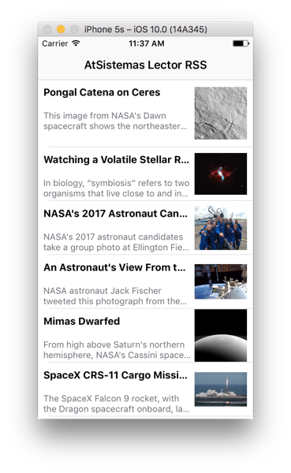
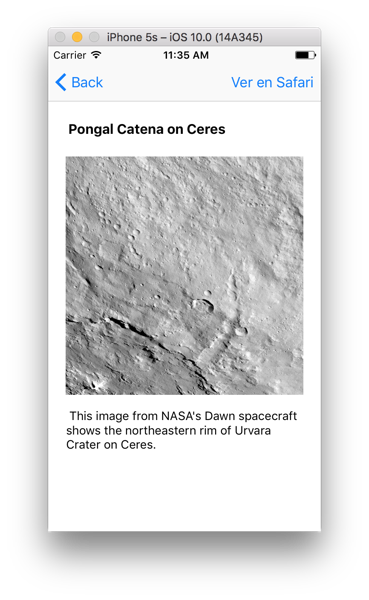

# atSistemas Lector RSS #

Proyecto a modo de prueba técnica para la empresa **atSistemas**. 

Es un sencillo lector RSS, que descarga las noticias del feed de la NASA, y las muestra en un listView. Al hacer click sobre alguna noticia, te la muestra en detalle. Utilizo `Core Data` a modo de persistencia de datos y caché, para poder ver las noticias en modo offline. He utilizado en esta ocasión el lenguaje `Objective-C`.

Para más información, visita mi blog: [www.oscargarrucho.com](http://oskarko.github.io/)